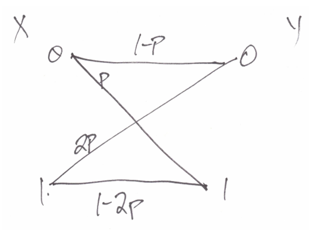

**4.** Consider a binary input, binary output channel as shown below. The probability of a \(0 \rightarrow 1\) error is \(p\), and the probability of a \(1 \rightarrow 0\) error is \(2p\). Obviously, take \(p < 1/2\). Let \(\pi_0 = P(X = 0)\). In this problem, compute entropy in nats, that is, use \(\ln\) and not \(\log_2\).

**(a)** Compute \(p y_0 = P(Y = 0)\).

**(b)** Obtain a formula for \(I(X, Y)\) in the form:
\[
I(X, Y) = \varphi(a) + b \varphi(p) + c \varphi(2p)
\]
where \(\varphi(\cdot)\) is the binary entropy function, and \(a\) involves both \(\pi_0\) and \(p\), and \(b, c\) only involve \(\pi_0\).

**(c)** Compute a formula for the derivative of the binary entropy function, \(\varphi'(x)\).

**(d)** We can find the channel capacity by setting \(\partial I / \partial p = 0\) or \(\partial I / \partial \pi_0 = 0\): which?

**(e)** Set up this equation, but do not try to simplify it or solve it. Just get it to the point where you can code this formula into MATLAB.

**(f)** You can either find an explicit formula for \(\pi_0\) in terms of \(p\), or use a nonlinear equation solver. Either way, from optimal \(\pi_0\), you can compute the channel capacity. Write MATLAB code to compute and graph \(C\) in bits (hint: \(\log_2 x = \ln x / \ln 2\)) and graph \(C\) versus \(p\), and optimal \(\pi_0\) versus \(p\). **Remark:** You may get numerical problems near endpoints (e.g., \(\log 0\) blows up), so stay away from \(p = 0\) and \(p = 1/2\), at least initially. I want to see nice graphs, computed at least at 100 points.

