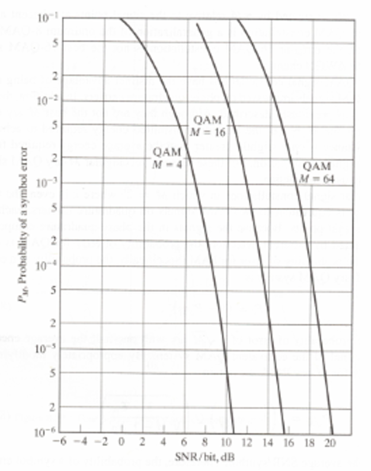
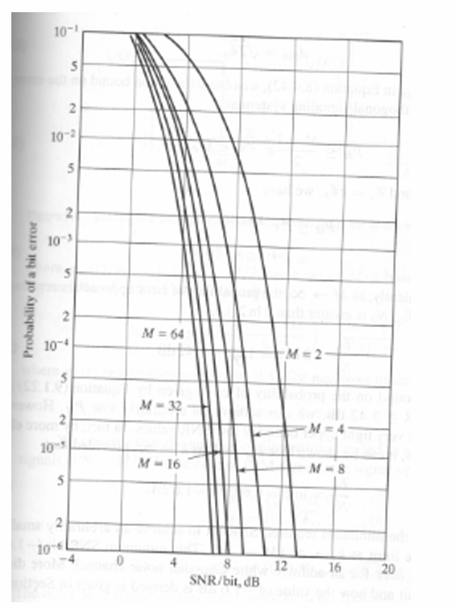

# Problem Set V: Digital Communications

## 1. This problem involves comparing various constellations

**(a)** Consider 16-QAM versus 16-orthogonal. For a target $P_e = 10^{-5}$, which requires more SNR per bit? How many more dB? [Use the performance curves provided in the notes, or in the textbook]

**(b)** Compute $\frac{(R/W)_{16-QAM}}{(R/W)_{16-orthogonal}}$.

**(c)** Consider binary FSK for two cases: orthogonal, and $\rho = 0.2$. Use the exact formula for coherent detection to compute the SNR per bit that achieves $P_e = 10^{-5}$. Use the performance curve (from notes or the textbook) to compute these values for the case of noncoherent detection.

---

## 2. Consider the 8-point constellation given by $I + jQ$, where $I \in \{ \pm \sqrt{E_0}, \pm 3\sqrt{E_0} \}$ and $Q \in \{ \pm \sqrt{E_0} \}$. This constellation, with equiprobable symbols, is used for transmission over an AWGN channel, resulting in $d_{min} = 2\sqrt{E_0}$, i.e., $E_0 = d^2_{min}/2$

**(a)** Sketch the constellation, and attempt Gray coding. If "exact" Gray coding is not possible, do the best you can.

**(b)** Compute $E_b$ in terms of $E_0$ (note that $E_0$ is not the average energy per symbol).

**(c)** List all the distance values, listed from smallest to largest (i.e., $d_1 = d_{min}$, the other distances are $d_1 < d_2 < \dots$), and the number of point pairs at each distance value. Remember to count the distance from $\vec{s}_i$ to $\vec{s}_j$ and from $\vec{s}_j$ to $\vec{s}_i$ separately, i.e., twice. As a check, the sum of the occurrences of distances between point pairs should be $8 \times 7$.

**(d)** The union bound for probability of error has the form:

$$
P_e \leq \sum a_k Q\left(\sqrt{b_k \gamma_b}\right)
$$

where for distance $d_k$, $a_k$ is related to the number of occurrences of this distance between points, and $b_k$ is related to $d_k / \sqrt{E_b}$ (I'm not saying it equals this — look up this formula in your notes). Compute all $\{a_k, b_k\}$ pairs for your constellation — you should be able to come up with specific numerical values. The above formula can be approximated by retaining just the term associated with $d_{min}$, i.e.,

$$
P_e \approx a_1 Q\left(\sqrt{b_1 \gamma_b}\right)
$$

Once you have found the constants that appear in these formulas, code up functions in MATLAB that compute these estimates of $P_e$ as a function of $\gamma_b$ given in units of dB/bit.

**(e)** On the same set of axes, graph $P_e$ computed using both the detailed and simplified formulas, with the horizontal axis $\gamma_b$ in dB/bit, and the vertical axis $P_e$ in the range $10^{-2} < P_e < 10^{-6}$ on a log scale. Since you don’t know the range of $\gamma_b$ in advance, you may need to do a bit of trial and error. Note: Use MATLAB `qfunc`.

---

## 3. A raised cosine pulse is used for transmitted data over a bandlimited channel at a rate $R_s$ symbols/sec. The pulse $p(t)$ has a spectrum $P(f)$ such that $P(0) = 1$, $P(1500 \text{Hz}) = 0.5$, and $P(1650 \text{Hz}) = 0$. Find the rolloff factor and $R_s$

---

## 4. Digital baseband processing is employed in a system which transmits 16-QAM at a bit rate $R_b = 1\text{Mbps}$ with a digital sampling rate of 32 samples per symbol. The transmitter employs a $\sqrt{\text{RC}}$ pulse shape with 50% rolloff. Find: the symbol rate $R_s$, the digital sampling rate $f_s$, and the transmit bandwidth $B_T$ (all in Hz)

---

## 5. Specify the phase trajectory (sequence of output phases) for $\pi/4$-DQPSK assuming initial phase of $0^\circ$ and the following input

11 10 00 01 10

Use the specified constellation given out in class.

---

## 6. A pulse used for BPSK transmission over a channel introduces ISI, resulting in a received filtered pulse $p(t)$ (seen at the output of the matched filter). With $T_s$ denoting the symbol time, we get

$$
p(-T_s) = 0.02, \, p(0) = -0.04, \, p(T_s) = 1.0, \, p(2T_s) = 0.06
$$

Assume the other samples are $0$. Hence, there are three interfering signal combinations.

---

One way to unravel this is to consider what you receive at time $t = nT_s$:

$$
\text{Received Signal: } \sum a[n-k] \cdot p(kT_s)
$$

- One term in the summation will correspond to the "target" signal (where $p(k_0 T_s) = 1$).
- All other terms serve as interference.

It’s worth noting that $p(\text{negative time})$ seems to violate causality. However, at time $nT_s$, symbols such as $a[n+1], a[n+2]$, etc., may still appear. This is because, in certain multipath environments, the dominant path is not always the shortest one (e.g., when the line of sight (LOS) is blocked).

In this context, with $p(k_0 T_s) = 1$, the "target" signal measured at the output of the matched filter at time $t = nT_s$ is:

$$
a[n-k_0]
$$

All other symbols $a[n-k]$, where $k \neq k_0$, contribute to inter-symbol interference (ISI).

---

**(a)** If $a_n$ denotes the $n$-th transmitted pulse, list the indices $a^?$ that interfere with $a_n$.

**(b)** Assuming $a_n = +1$, list the $\pm1$ values of the interfering symbols that cause the worst-case interference, i.e., the maximal cancellation.

**(c)** Assuming all binary digits are equiprobable and independent, what is the probability that the adjacent symbols cause this worst-case interference?

**(d)** Assuming the SNR is $15\text{dB}$, compute the Signal-to-Interference Ratio (SIR) and Signal-to-Noise-and-Interference Ratio (SNIR) in $\text{dB}$, where the interference power is computed assuming worst-case interference.
