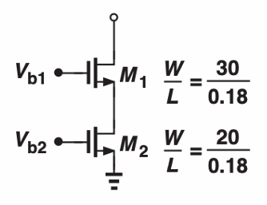

# Homework #2

## 2-1

The cascode current source shown below must be designed to have a bias current of 0.5mA. Let’s assume $u_nC_{ox} = 100\mu A/V^2$ and $V_{TH} = 0.4V$.

1. Neglecting channel-length modulation, compute the required value of $V_{b2}$. What is the minimum value of $V_{b1}$ if $M_2$ must remain in saturation?
2. Assuming $\lambda = 0.1V^{-1}$, calculate the output impedance of the circuit.

---

## 2-2

I’d like to stack one more device to boost output impedance more. But, due to the limited $V_{DD}$, it is not recommended. Then I’d like to use the below structure to increase output impedance more than $Q_{2-1}$ and utilize it as part of an amplifier.

- Convert to small signal model and derive output impedance in terms of $(g_{m2}, r_{o1}, r_{o2}$ and $A)$. [20 points]

---

## 2-3

Find the drain current of $M_4$ if all the transistors are in saturation and neglecting channel length modulation. $I_{REF} = 0.1mA$.

---

## 2-4

Design and simulate two current mirrors shown below using TSMC 65nm PDK. Optimize circuits to have an output current of 1mA, and $V_P$ node to have 500mV (±10mV) for Fig.(a), 700mV (±20mV) for Fig.(b). Use an ideal current source for $I_{ref}$.

- Sweep the output voltage from 0.5V to 1V for Fig.(a) and 0.7V to 1.2V for Fig.(b), and plot how $I_{out}$ of two current mirrors changes.
- Compare both $I_{out}$ and explain why there are different variations and which structure shows more ideal current source $(I_{out})$.

Use minimum length (60nm) for all devices.

| Target    | Fig. (a)  | Fig. (b)  |
| ---       | ---       | ---       |
| Are all Transistors in saturation mode with target voltage on VP node? | 5 | 5 |
| Output current = 1mA (@Vout = 0.5V for Fig.(a) and 0.7V for Fig.(b)) | 5 | 5 |
| Is the output current plot reasonable? | 5 | 5 |
| Is the explanation correct? | 10 |

---

## 2-5

Referring to Fig.(a), output current $I_{out}$ varies around 50% when output voltage changes from 0.5V to 1V. Optimize $M_2$ to decrease variation of $I_{out}$ to less than 10% and show the plots before and after optimization.

- Now, you are free to use any lengths for the device.
- Maintain $I_{out} = 1mA$ (±10mA) even after optimization when the output voltage is 0.5V.

> (For your information, $I_{out}$ variation should be zero in the ideal case because the ideal current source should generate constant $I_{out}$ regardless of voltage variation across the current source.)

> (For Q2-4, Q2-5, include a snapshot of your schematic/simulation results with each W and L values of devices and turn on “annotate->operating mode” so I can see details such as saturation/triode/$V_{dsat}$ etc.)

---

## [Bonus point – 10 points]

Optimize Fig.(b) to have $I_{out}$ variation less than 1% when $V_{out}$ varies from 0.7 to 1.2V. Explain why your approach helps.Here's the content in markdown format:
