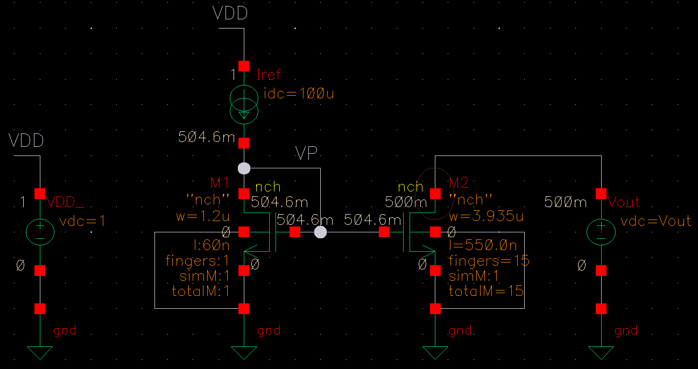

# Homework 2 Virtuoso Questions

## 2.4

fig.(a) widths and lengths

fig.(a) operating points

fig.(a) simulation results

fig.(b) widths and lengths

fig.(b) operating points

fig.(b) simulation results

$I_{out}$ varies less in fig.(b) because the output impendance is higher than fig.(a). Higher output impedance means that the output current is less affected by the output voltage. As an ideal current source has infinite output impedance, the structure in fig.(b) is closer to an ideal current source.

## 2.5

fig.(a) widths and lengths

fig.(a) operating points

fig.(a) simulation results

## Bonus

fig.(b) widths and lengths

fig.(b) operating points

fig.(b) simulation results

I increased the output impedance by increasing the lengths of the M5 and M6 transistors. The lengths of the transistors are inversely proportional to the drain current, which is inversely proportional to the output impedance. Thus the lengths of the transistors are directly proportional to the output impedance. The higher output impedance means that the output current is less affected by the output voltage.

$$
r_{o} = \frac{1}{\lambda I_{D}}, \quad I_{D} = \frac{1}{2}u_nC_{ox}\frac{W}{L}(V_{GS} - V_{TH})^2
$$

$$
r_{o} = \frac{1}{\lambda \frac{1}{2}u_nC_{ox}\frac{W}{L}(V_{GS} - V_{TH})}, \quad r_{o} \propto \frac{L}{W}
$$
