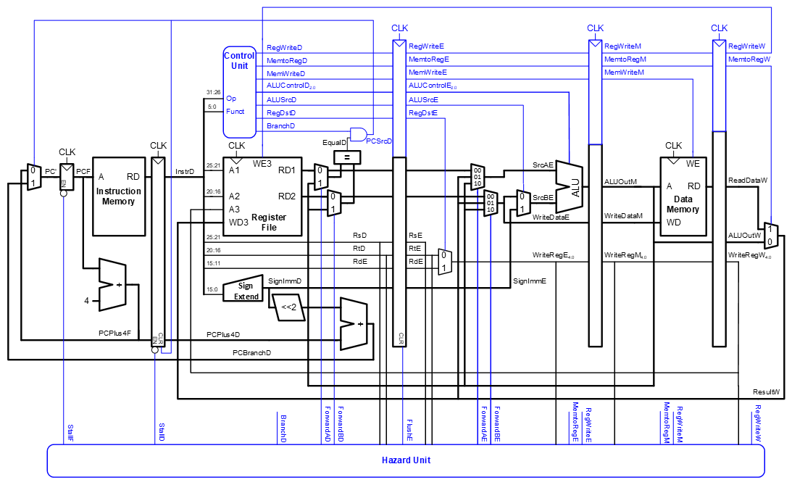
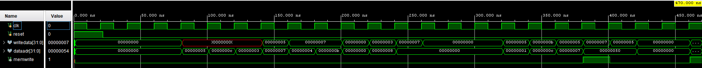
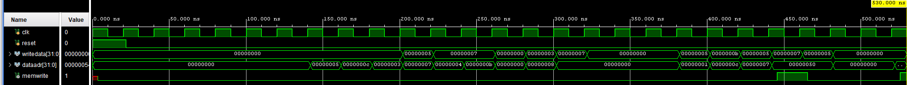
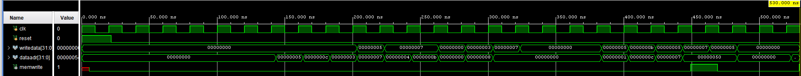

# Implementation of a Pipelined MIPS Processor

## Overview of MIPS and ARM Processors

### MIPS Processors

MIPS processors are built around the RISC (Reduced Instruction Set Computer) architecture, focusing on simplicity and high-speed instruction execution. The architecture utilizes a load/store model where memory access is restricted to dedicated load and store instructions, which helps streamline the execution pipeline. Pipelined MIPS typically features a five-stage pipeline (Fetch, Decode, Execute, Memory Access, and Write-back) to maximize throughput by executing different stages of multiple instructions simultaneously. With 32 general-purpose registers, MIPS achieves efficiency through minimalistic instruction design. The control unit handles instruction decoding and manages data flow across the processor’s functional blocks. Despite pipeline hazards, such as data and control hazards, MIPS maintains high performance through mechanisms like forwarding, stalling and branch delay slots. Its simplicity makes it a popular choice in embedded systems, educational environments, and certain consumer electronics.

### ARM Processors

Like MIPS, ARM processors follow the RISC design principles but have evolved to provide more versatility and efficiency. ARM uses a load/store architecture with a combination of 32-bit and, in some cases, 16-bit (Thumb) instructions to improve memory efficiency. ARM processors incorporate features like deep pipelining and superscalar execution, enabling multiple instructions to be fetched, decoded, and executed concurrently, leading to higher performance. ARM’s functional blocks include 16 general-purpose registers, an ALU, and often a Floating-Point Unit (FPU) for handling more complex computations. Conditional execution of most instructions and SIMD support through NEON technology are key features that enhance ARM’s efficiency and performance for multimedia tasks. Power efficiency is a notable strength of ARM’s design, making it dominant in mobile devices, IoT, and wearable technologies. It has also made inroads into desktop and server markets, where efficiency and high performance are crucial.

Both MIPS and ARM share the RISC architectural foundation, but they diverge significantly in their design focus and applications. MIPS emphasizes a simple, efficient design well-suited for embedded systems and learning, while ARM focuses on scalable power efficiency, making it ideal for a broad spectrum of applications, like mobile, embedded, and personal computing.

## Implemented MIPS Processor

The MIPS processor implemented in this project divides a standard single-cycle processor into 5 stages, inspired by D. Harris and S. L. Harris, *Digital Design and Computer Architecture*.



As each stage can be executed simultaneously, pipelining will ideally make throughput five times better.

- In the Fetch stage, the processor reads the instruction from instruction memory.
- In the Decode stage, the processor reads the source operands from the register file and decodes the instruction to produce the control signals.
- In the Execute stage, the processor performs a computation with the ALU.
- In the Memory stage, the processor reads or writes data memory.
- In the Writeback stage, the processor writes the result to the register file, when applicable.

The figure below illustrates the timing diagram differences between single-cycle and pipeline


### Program Counter

The program counter is an ordinary 32-bit register. Its output, PC, points to the current instruction. Its input, PC′, indicates the address of the next instruction.

### Instruction Memory

The instruction memory has a single read port.1 It takes a 32-bit instruction address input, A, and reads the 32-bit data (i.e., instruction) from that address onto the read data output, RD.

### Register File

The 32-element×32-bit register file has two read ports and one write port. The read ports take 5-bit address inputs, A1 and A2, each specifying one of 25=32 registers as source operands. They read the 32-bit register values onto read data outputs RD1 and RD2, respectively. The write port takes a 5-bit address input, A3; a 32-bit write data input, WD; a write enable input, WE3; and a clock. If the write enable is 1, the register file writes the data into the specified register on the rising edge of the clock

### Data Memory

The data memory has a single read/write port. If the write enable, WE, is 1, it writes data WD into address A on the rising edge of the clock. If the write enable is 0, it reads address A onto RD.

### Arithmetic Logic Unit

The ALU implemented in this processor can perform AND, OR, & SET IF LESS THAN logic, as well as addition, and subtraction arithmetic

| ALUOp |  Funct        | ALUControl          |
|-------|---------------|---------------------|
| 00    | X             | 010 (add)           |
| X1    | X             | 110 (subtract)      |
| 1X    | 100000 (add)  | 010 (add)           |
| 1X    | 100010 (sub)  | 110 (subtract)      |
| 1X    | 100100 (and)  | 000 (and)           |
| 1X    | 100101 (or)   | 001 (or)            |
| 1X    | 101010 (slt)  | 111 (set less than) |

### Control Unit

The control unit computes the control signals based on the opcode and funct fields of the instruction, Instr31:26 and Instr5:0

| Instruction | Opcode  | RegWrite | RegDst | ALUSrc | Branch | MemWrite | MemtoReg | ALUOp |
|-------------|---------|----------|--------|--------|--------|----------|----------|-------|
| R-type      | 000000  | 1        | 1      | 0      | 0      | 0        | 0        | 10    |
| lw          | 100011  | 1        | 0      | 1      | 0      | 0        | 1        | 00    |
| sw          | 101011  | 0        | X      | 1      | 0      | 1        | X        | 00    |
| beq         | 000100  | 0        | X      | 0      | 1      | 0        | X        | 01    |

### Hazard Unit

In a pipelined system, multiple instructions are handled concurrently. When one instruction is dependent on the results of another that has not yet completed, a hazard occurs.

A **data hazard** occurs when an instruction tries to read a register that has not yet been written back by a previous instruction. A **control hazard** occurs when the decision of what instruction to fetch next has not been made by the time the fetch takes place.

#### Data Hazards

Some data hazards can be solved by forwarding (also called bypassing)a result from the Memory or Writeback stage to a dependent instruction in the Execute stage. This requires adding multiplexers in front of the ALU to select the operand from either the register file or the Memory or Write back stage.

Forwarding is sufficient to solve RAW data hazards when the result is computed in the Execute stage of an instruction, because its result can then be forwarded to the Execute stage of the next instruction. Unfortu nately, the lw instruction does not finish reading data until the end of the Memory stage, so its result cannot be forwarded to the Execute stage of the next instruction. The alternative solution is to stall the pipeline, holding up operation until the data is available. stalling a stage is performed by disabling the pipeline register, so that the contents do not change. When a stage is stalled, all previous stages must also be stalled, so that no subsequent instructions are lost. The pipeline register directly after the stalled stage must be cleared to prevent bogus information from propagating forward.

The MemtoReg signal is asserted for the lw instruction. Hence, the logic to compute the stalls and flushes is

```verilog
 lwstall=((rsD==rtE) OR (rtD==rtE)) AND MemtoRegE
 StallF =StallD=FlushE=lwstall
```

#### Control Hazards

Control hazards are solved by predicting which instruction should be fetched and flushing the pipeline if the prediction is later determined to be wrong. Moving the decision as early as possible mini mizes the number of instructions that are flushed on a misprediction.

```verilog
// Hazard detection unit
module hazard(input  [4:0] rsD, rtD, rsE, rtE, 
              input  [4:0] writeregE, writeregM, writeregW,
              input        regwriteE, regwriteM, regwriteW,
              input        memtoregE, memtoregM, branchD,
              output           forwardaD, forwardbD,
              output reg [1:0] forwardaE, forwardbE,
              output       stallF, stallD, flushE);

  wire lwstallD, branchstallD;

  // forwarding sources to D stage (branch equality)
  assign forwardaD = (rsD !=0 & rsD == writeregM & regwriteM); // forward from memory stage if needed
  assign forwardbD = (rtD !=0 & rtD == writeregM & regwriteM); // forward from memory stage if needed

  // forwarding sources to E stage (ALU)
  always @(*)
    begin
      forwardaE = 2'b00; forwardbE = 2'b00;
      if (rsE != 0)
        if (rsE == writeregM & regwriteM) forwardaE = 2'b10; // forward from memory stage
        else if (rsE == writeregW & regwriteW) forwardaE = 2'b01; // forward from writeback stage
      if (rtE != 0)
        if (rtE == writeregM & regwriteM) forwardbE = 2'b10; // forward from memory stage
        else if (rtE == writeregW & regwriteW) forwardbE = 2'b01; // forward from writeback stage
    end

  // stalls  
  assign #1 lwstallD = memtoregE & (rtE == rsD | rtE == rtD); // stall if load-use hazard detected
  assign #1 branchstallD = branchD & 
             (regwriteE & (writeregE == rsD | writeregE == rtD) |
              memtoregM & (writeregM == rsD | writeregM == rtD)); // stall if branch hazard detected

  assign #1 stallD = lwstallD | branchstallD; // stall decode stage if needed
  assign #1 stallF = stallD; // stalling D stalls all previous stages
  assign #1 flushE = stallD; // stalling D flushes next stage

  // *** not necessary to stall D stage on store if source comes from load;
  // *** instead, another bypass network could be added from W to M
endmodule
```

## Core Instructions

The core instructions implemented in this processor are:

- **R-type**: ADD, SUB, AND, OR, SLT

```verilog
// ALU decoder for determining operation
module aludec(input      [5:0] funct,
              input      [1:0] aluop,
              output reg [2:0] alucontrol);

  always @(*)
    case(aluop)
      2'b00: alucontrol <= 3'b010;  // add
      2'b01: alucontrol <= 3'b110;  // subtract
      default: case(funct)          // R-type instruction
          6'b100000: alucontrol <= 3'b010; // ADD
          6'b100010: alucontrol <= 3'b110; // SUB
          6'b100100: alucontrol <= 3'b000; // AND
          6'b100101: alucontrol <= 3'b001; // OR
          6'b101010: alucontrol <= 3'b111; // SLT (set on less than)
          default:   alucontrol <= 3'bxxx; // Undefined
        endcase
    endcase
endmodule
```

```verilog
// ALU module
module alu(input      [31:0] a, b, 
           input      [2:0]  alucont, 
           output reg [31:0] result);

  wire [31:0] b2, sum, slt;

  assign #1 b2 = alucont[2] ? ~b:b;  // determine if subtraction (invert b)
  assign #1 sum = a + b2 + alucont[2]; // add a and b (or subtract if b is inverted)
  assign #1 slt = sum[31]; // set on less than (for signed comparison)

  always@(*)
    case(alucont[1:0])
      2'b00: result <= #1 a & b; // AND operation
      2'b01: result <= #1 a | b; // OR operation
      2'b10: result <= #1 sum;   // ADD/SUB operation
      2'b11: result <= #1 slt;   // Set on less than
    endcase
endmodule
```

- **I-type**: LW, SW, ADDI, BEQ
- **J-type**: JUMP

```verilog
// Main decoder for instruction type
module maindec(input  [5:0] op,
               output       memtoreg, memwrite,
               output       branch, alusrc,
               output       regdst, regwrite,
               output       jump,
               output [1:0] aluop);

  reg [9:0] controls;

  assign {regwrite, regdst, alusrc,
          branch, memwrite,
          memtoreg, jump, aluop} = controls;

  always @(*)
    case(op)
      6'b000000: controls <= 9'b110000010; // R-type instruction
      6'b100011: controls <= 9'b101001000; // Load Word (LW)
      6'b101011: controls <= 9'b001010000; // Store Word (SW)
      6'b000100: controls <= 9'b000100001; // Branch if Equal (BEQ)
      6'b001000: controls <= 9'b101000000; // Add Immediate (ADDI)
      6'b000010: controls <= 9'b000000100; // Jump (J)
      default:   controls <= 9'bxxxxxxxxx; // Undefined
    endcase
endmodule
```

## Testbench Analysis

The testbench provided for this implementation is designed to validate the functionality of various aspects of the processor. An `instructions.mem` file is included in the instructions memory module to load the correct instructions for this testbench.

```text
20020005 00000000: addi $2, $0, 5          # initialize $2 = 5  
2003000c 00000004: addi $3, $0, 12         # initialize $3 = 12 
2067fff7 00000008: addi $7, $3, -9         # initialize $7 = 3  
00e22025 0000000c: or   $4, $7, $2         # $4 <= 3 or 5 = 7   
00642824 00000010: and  $5, $3, $4         # $5 <= 12 and 7 = 4 
00a42820 00000014: add  $5, $5, $4         # $5 = 4 + 7 = 11    
10a7000a 00000018: beq  $5, $7, end        # shouldn't be taken 
0064202a 0000001c: slt  $4, $3, $4         # $4 = 12 < 7 = 0    
10800001 00000020: beq  $4, $0, around     # should be taken    
20050000 00000024: addi $5, $0, 0          # shouldn't happen   
00e2202a 00000028: slt  $4, $7, $2         # $4 = 3 < 5 = 1     
00853820 0000002c: add  $7, $4, $5         # $7 = 1 + 11 = 12   
00e23822 00000030: sub  $7, $7, $2         # $7 = 12 - 5 = 7    
ac670044 00000034: sw   $7, 68($3)         # [80] = 7           
8c020050 00000038: lw   $2, 80($0)         # $2 = [80] = 7      
08000011 0000003c: j    end                # should be taken    
20020001 00000040: addi $2, $0, 1          # shouldn't happen   
ac020054 00000044: sw   $2, 84($0)         # write adr 84 = 7   
```

The testbench checks if the processor correctly executes instructions and writes the expected data 7 to memory address 84.

### Behavioral vs. Synthesized/Implemented Results

*Behavioral Waveform*


*Synthesized Waveform*


*Implemented Waveform*


As can be seen from the above waveforms, the synthesized and implemented Waveforms are very similar to the behavorial waveform but takes into consideration realistic delays in paths.

## FPGA Utilization

The MIPS processor is implemented on the ZedBoard to evaluate resource usage. The FPGA utilization metrics include:

- **LUTs (Look-Up Tables)**: 507 used out of 53,200 available, resulting in a utilization of approximately 0.95%.
- **LUTRAM**: 44 used out of 17,400 available, resulting in a utilization of approximately 0.25%.
- **Flip-Flops (FF)**: 231 used out of 106,400 available, resulting in a utilization of approximately 0.22%.
- **BRAM (Block RAM)**: 0.5 blocks used out of 140 available, resulting in a utilization of approximately 0.36%.
- **IO Pins**: 67 used out of 200 available, resulting in a utilization of 33.5%.

The low utilization percentages for LUTs, LUTRAM, and FFs indicate that the implemented design is efficient in terms of resource consumption.

## Timing Analysis

- **Worst Negative Slack (WNS)**: The WNS is 1.045 ns, indicating that the design comfortably meets the timing requirements, as there is no violation and a positive slack margin. This metric represents the difference between the required time and the actual arrival time of the slowest path.
- **Total Negative Slack (TNS)**: The TNS is 0.000 ns, which means that there are no paths in the design that fail to meet the timing constraints. A TNS of zero confirms that the design is all positive slack.

The positive WNS and zero TNS indicate that the implemented MIPS processor is capable of operating at the intended clock frequency without any timing issues, ensuring reliable operation in an FPGA environment.

## Reflection

- What did you enjoy about this project?
  - I enjoyed learning the complexities of pipelining, especially when it came to addressing the Hazards. Despite it initially being hard to comprehend and implement, the ability to process multiple instructions in parallel felt like a huge advancement, despite the relatively low addition of complexity.
- What did you not like?
  - Utilizing Vivado was very tiresome, as there were warnings and errors that I could not make sense of, especially coming from successful simulating in iverilog. It felt hopeless at times, and in the end I had to leave some warnings and problems unresolved.
- What was the hardest part?
  - I believe the conceptually hardest part was implementing pipelining. In writing, it seemed very straightforward, however properly implementing the datapath and control unit while keeping each stage in mind was difficult.
- What did you learn?
  - I refreshed a lot of my computer architecture skills and was reminded of how interesting it is. I of course learned how to implement pipelining, but also learned different ways to analyze a system using vivado, and how to interpret the results.
