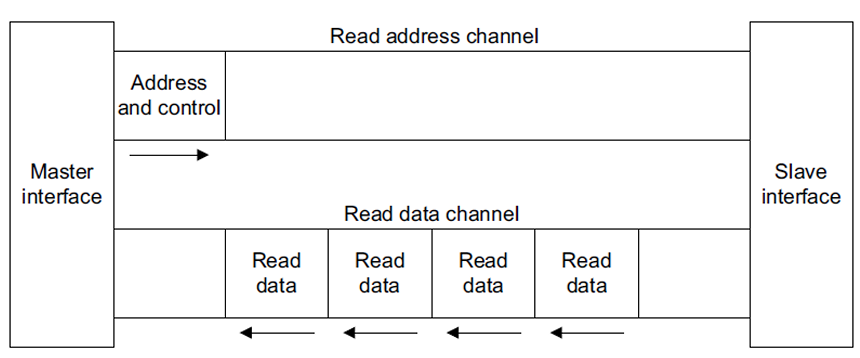
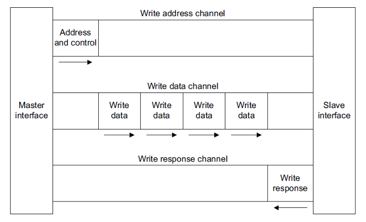
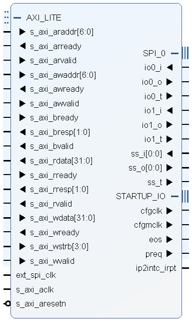
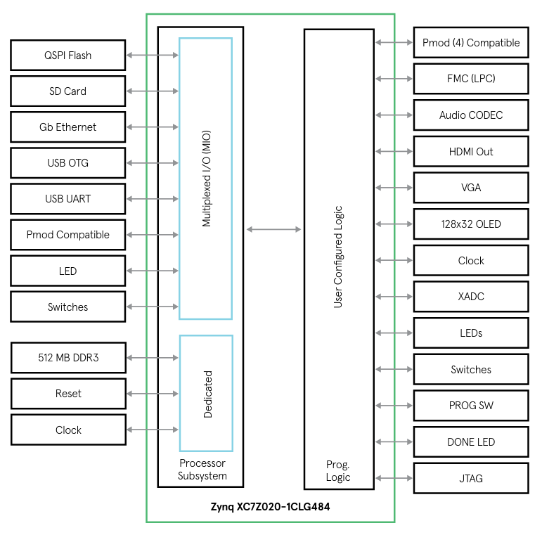
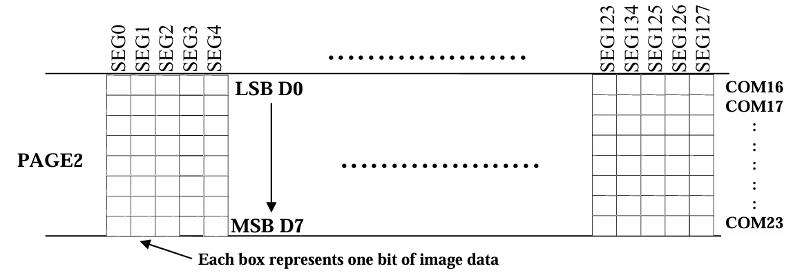

# Project 2 Report: OLED on Zedboard

## Overview

1. Instantiate an AXI-SPI Core in the PL of the Zynq SoC to handle SPI communication.
2. The PS writes data to the AXI-SPI core via AXI4-Lite.
3. The AXI-SPI core in the PL sends the SPI data to the OLED display.

## OLED Interfaces

- **GPIO (Parallel)**: Uses multiple pins to transfer data in parallel, offering high-speed communication but requiring many GPIO pins, which can be complex to wire and debug.

- **I2C**: A two-wire serial interface (SDA for data, SCL for clock) that is simple to wire and allows multiple devices on the same bus but operates at a slower speed compared to SPI, making it ideal for simpler displays.

- **SPI**: Several variations, but generally a two to four wire serial interface that provides faster communication than I2C with fewer pins than GPIO, striking a balance between speed and pin usage for moderately complex displays.

This project implements the SPI interface to communicate with the OLED display.

## ARM Advanced Microcontroller Bus Architecture (AMBA)

The Advanced Microcontroller Bus Architecture (AMBA) is an open-standard interconnect system developed by ARM for efficient on-chip communication in System-on-Chip (SoC) designs. Key protocols include:

1. **AHB (Advanced High-performance Bus)**: High-bandwidth, pipelined bus for fast data transfers, ideal for processors and high-speed peripherals.

2. **APB (Advanced Peripheral Bus)**: Simplified, low-power bus for slower peripherals like GPIOs and timers, with reduced complexity.

3. **AXI (Advanced eXtensible Interface)**: High-performance bus supporting multiple masters, separate read/write channels, and efficient memory access, used for data-intensive tasks.

4. **ACE (AXI Coherency Extensions)**: Adds cache coherency for multi-core systems, crucial for synchronized data access.

5. **CHI (Coherent Hub Interface)**: High-bandwidth protocol for data center applications, maintaining data coherency across distributed systems.

### AXI (Advanced eXtensible Interface)

1. **AXI3**:
   - The original AXI specification.
   - Supports up to 16 data beats per burst.
   - Does not support features like QoS (Quality of Service) and user-defined signaling present in later versions.
   - Commonly used in systems where backward compatibility is required.

2. **AXI4**:
   - An enhanced version of AXI3, widely used in modern SoCs.
   - Supports up to 256 data beats per burst, increasing data throughput.
   - Adds features like QoS signaling for managing data flow priorities.
   - Supports both high-bandwidth and low-latency requirements, making it suitable for high-performance applications.

3. **AXI4-Lite**:
   - A simplified, low-resource version of AXI4, supporting only single 32-bit data transfers.
   - Does not support burst transactions, making it ideal for low-speed, low-power peripherals.
   - Commonly used for control registers and simple peripheral communications.

4. **AXI4-Stream**:
   - Designed for unidirectional, high-throughput data streaming without addressing overhead.
   - Does not use address channels, focusing solely on continuous data transfer.
   - Ideal for applications requiring high data rates, such as video processing, networking, and digital signal processing (DSP).

5. **AXI5**:
   - The latest update to AXI, introduced by ARM to improve cache coherency and system efficiency.
   - Supports advanced coherency protocols and fault tolerance features for high-reliability applications.
   - Mainly used in multi-core systems that require sophisticated memory consistency across processors.

## AXI4-Lite Protocol

- The **read address channel** carries addressing information and handshaking signals
- The **read data channel** carries the data values and handshaking signals

- The **write address channel** carries addressing information and handshaking signals
- The **write data channel** carries the data values and handshaking signals
- The **write response channel** allows the slave peripheral to acknowledge receipt of the data

### AXI4-Lite Ports

\
*From Vivado AXI Quad SPI IP*

### Read Transactions

**Handshaking Signals:**

The handshaking signals are based on a simple "Ready/Valid" principle:

- "Ready" indicates that the recipient is ready to accept data.
- "Valid" indicates that the sender has valid data to send.

Either state can be asserted first:

> "A frequently misunderstood use of the Valid and Ready signals, and one which often results in incorrect and illegal implementations of the AXI4-lite protocol, is the assumption that the sender can/must wait for “Ready” to be asserted by the receiver before it asserts its “Valid” signal. This is an illegal use of the handshaking signals and can result in a deadlock situation arising. Ready can be asserted before Valid, but the sender must never wait for Ready as a pre-condition to commencing the transaction."

#### AXI4-lite Read Address Channel

| Signal Name   | Size    | Driven by | Description                                                                           |
|---------------|---------|-----------|---------------------------------------------------------------------------------------|
| S_AXI_ARADDR  | 32 bits | Master    | Address bus from AXI interconnect to slave peripheral.                                |
| S_AXI_ARVALID | 1 bit   | Master    | Valid signal, asserting that the S_AXI_AWADDR can be sampled by the slave peripheral. |
| S_AXI_ARREADY | 1 bit   | Slave     | Ready signal, indicating that the slave is ready to accept the value on S_AXI_AWADDR. |

#### AXI4-lite Read Data Channel

| Signal Name  | Size    | Driven by | Description                                                                                                      |
|--------------|---------|-----------|------------------------------------------------------------------------------------------------------------------|
| S_AXI_RDATA  | 32 bits | Slave     | Data bus from the slave peripheral to the AXI interconnect.                                                      |
| S_AXI_RVALID | 1 bit   | Slave     | Valid signal, asserting that the S_AXI_RDATA can be sampled by the Master.                                       |
| S_AXI_RREADY | 1 bit   | Master    | Ready signal, indicating that the Master is ready to accept the value on the other signals.                      |
| S_AXI_RRESP  | 2 bits  | Slave     | A "Response" status signal showing whether the transaction completed successfully or whether there was an error. |

##### S_AXI_RRESP Signals

| RRESP State [1:0] | Condition | Description                                                                                                                                                                                               |
|-------------------|-----------|-----------------------------------------------------------------------------------------------------------------------------------------------------------------------------------------------------------|
| 00                | OKAY      | "OKAY" - The data was received successfully, and there were no errors.                                                                                                                                    |
| 01                | EXOKAY    | "Exclusive Access OK" - This state is only used in the full implementation of AXI4, and therefore cannot occur when using AXI4-Lite.                                                                      |
| 10                | SLVERR    | "Slave Error" - The slave has received the address phase of the transaction correctly but needs to signal an error condition to the master. Often results in a retry.                                     |
| 11                | DECERR    | "Decode Error" - This condition is not normally asserted by a peripheral but can be asserted by the AXI interconnect logic. It indicates the address doesn’t exist in the AXI interconnect address space. |

### Write Transactions

Write transactions are almost identical to the Read transactions discussed above, except that the Write Data Channel has one signal that is different to the Read Data Channel.

#### AXI4-lite Write Address Channel

| Signal Name   | Size    | Driven by | Description                                                                                                   |
|---------------|---------|-----------|---------------------------------------------------------------------------------------------------------------|
| S_AXI_AWADDR  | 32 bits | Master    | Address bus from AXI interconnect to slave peripheral.                                                        |
| S_AXI_AWVALID | 1 bit   | Master    | Valid signal, asserting that the S_AXI_AWADDR can be sampled by the slave peripheral.                         |
| S_AXI_AWREADY | 1 bit   | Slave     | Ready signal, indicating that the slave is ready to accept the value on S_AXI_AWADDR.                         |

#### AXI4-lite Write Data Channel

| Signal Name  | Size    | Driven by | Description                                                                                             |
|--------------|---------|-----------|---------------------------------------------------------------------------------------------------------|
| S_AXI_WDATA  | 32 bits | Master    | Data bus from the Master / AXI interconnect to the Slave peripheral.                                    |
| S_AXI_WVALID | 1 bit   | Master    | Valid signal, asserting that the S_AXI_RDATA can be sampled by the Master.                              |
| S_AXI_WREADY | 1 bit   | Slave     | Ready signal, indicating that the Master is ready to accept the value on the other signals.             |
| S_AXI_WSTRB  | 4 bits  | Master    | A "Strobe" status signal showing which bytes of the data bus are valid and should be read by the Slave. |

##### S_AXI_WSTRB Signals

| S_AXI_WSTRB [3:0] | S_AXI_WDATA active bits [31:0]   | Description                            |
|-------------------|----------------------------------|----------------------------------------|
| 1111              | 11111111111111111111111111111111 | All bits active                        |
| 0011              | 00000000000000001111111111111111 | Least significant 16 bits active       |
| 0001              | 00000000000000000000000011111111 | Least significant byte (8 bits) active |
| 1100              | 11111111111111110000000000000000 | Most significant 16 bits active        |

#### AXI4-lite Write Response Channel

| Signal Name  | Size   | Driven by | Description                                                                                                      |
|--------------|--------|-----------|------------------------------------------------------------------------------------------------------------------|
| S_AXI_BREADY | 1 bit  | Master    | Ready signal, indicating that the Master is ready to accept the "BRESP" response signal from the slave.          |
| S_AXI_BRESP  | 2 bits | Slave     | A "Response" status signal showing whether the transaction completed successfully or whether there was an error. |
| S_AXI_BVALID | 1 bit  | Slave     | Valid signal, asserting that the S_AXI_BRESP can be sampled by the Master.                                       |

---

[Other Port Descriptions](https://docs.amd.com/r/en-US/pg153-axi-quad-spi/Port-Descriptions)

## Zedboard

> An Inteltronic/Wisechip UG-2832HSWEG04 **OLED** Display is used on the ZedBoard. This provides a 128x32 pixel, passive-matrix, monochrome display. The display size is 30mm x 11.5mm x 1.45mm.

### UG-2832HSWEG04 OLED Display

#### OLED Interface Pinout

| Pin Number | Symbol | Zynq Pin | Function                              |
|------------|--------|----------|---------------------------------------|
| **Interface** ||||
| 9          | RES#   | U9       | Power Reset for Controller and Driver |
| 8          | CS#    | N/C      | Chip Select – Pulled Down on Board    |
| 10         | D/C#   | U10      | Data/Command Control                  |
| 11         | SCLK   | AB12     | Serial Clock Input Signal             |
| 12         | SDIN   | AA12     | Serial Data Input Signal              |

The UG-2832HSWEG04 is a 0.91-inch OLED display module featuring a 128×32 pixel resolution and a 4-wire Serial Peripheral Interface (SPI) for communication. This interface facilitates efficient data transfer between the display module and a microcontroller.

#### SPI Interface Pins

The display module utilizes the following pins for SPI communication:

- **CS# (Chip Select):** Active-low input that enables the display module when pulled low.
- **RES# (Reset):** Active-low input that resets the display module when pulled low.
- **D/C# (Data/Command):** Determines the nature of the data; high for data, low for command.
- **SCLK (Serial Clock):** Clock signal generated by the master device to synchronize data transmission.
- **SDIN (Serial Data Input):** Serial data line for transmitting data from the master to the display module.

#### Communication Protocol

1. **Initialization:**
   - Pull **RES#** low to reset the display module.
   - Set **RES#** high to complete the reset process.

2. **Data Transmission:**
   - Set **CS#** low to select the display module.
   - Use **D/C#** to specify the nature of the data:
     - Set **D/C#** low for command bytes.
     - Set **D/C#** high for data bytes.
   - Transmit data via **SDIN**, synchronized with the **SCLK** signal. Data is latched on the rising edge of **SCLK**.

3. **Termination:**
   - After data transmission, set **CS#** high to deselect the display module.

---

References:

[1] [designing_a_custom_axi_slave_rev1](https://www.avnet.com/wps/wcm/connect/onesite/557e3453-20d7-4737-b2a8-8afc404dc81e/designing_a_custom_axi_slave_rev1.pdf?MOD=AJPERES&CVID=nxFlYvm&CVID=nxFlYvm&CVID=nxFlYvm&CVID=nxFlYvm)

[2] [ZedBoard_HW_Users_Guide](https://www.avnet.com/wps/wcm/connect/onesite/922900e3-3d57-4cc7-883f-a8b9fbea0cd0/ZedBoard_HW_UG_v2_2.pdf?MOD=AJPERES&CACHEID=ROOTWORKSPACE.Z18_NA5A1I41L0ICD0ABNDMDDG0000-922900e3-3d57-4cc7-883f-a8b9fbea0cd0-nxyWMFS)

[3] [OLED Display Datasheet](https://cdn-shop.adafruit.com/datasheets/UG-2832HSWEG04.pdf)

[4] [SSD1306 Datasheet](https://cdn-shop.adafruit.com/datasheets/SSD1306.pdf)