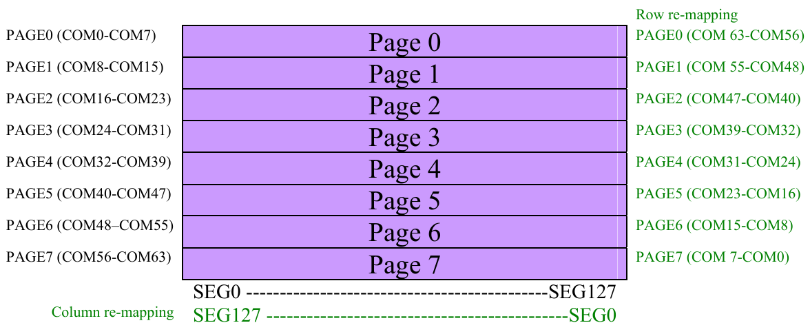
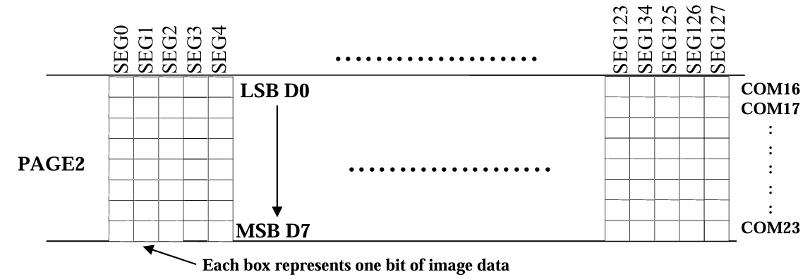
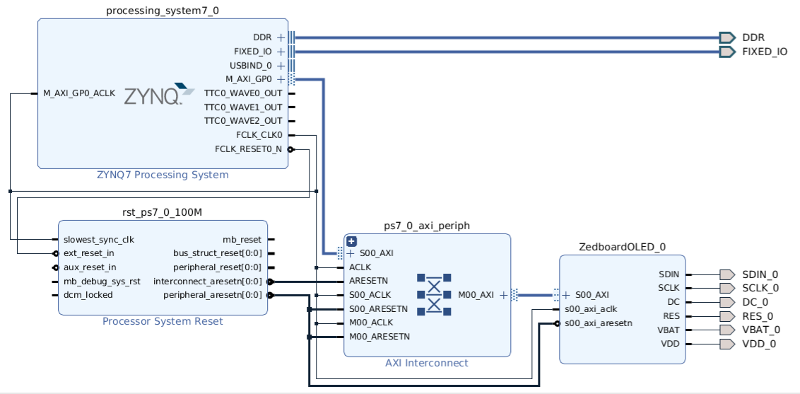

# Project 2 Report: OLED Interface

## AXI4-Lite Protocol

### Channels & Signal Groups

#### Write Address Channel

- Sends the address of the slave register to be written.
- Signals:
  - `AWVALID`: Indicates the address is valid.
  - `AWREADY`: Slave acknowledges the address.
  - `AWADDR`: The 32-bit address to be accessed.

#### Write Data Channel

- Transfers the data to be written to the slave.
- Signals:
  - `WVALID`: Indicates the data is valid.
  - `WREADY`: Slave acknowledges the data.
  - `WDATA`: The 32-bit data to be written.
  - `WSTRB`: Write strobe bits, specifying which byte lanes are valid.

#### Write Response Channel

- Provides feedback about the write operation.
- Signals:
  - `BVALID`: Indicates the response is valid.
  - `BREADY`: Master acknowledges the response.
  - `BRESP`: Response status (e.g., OKAY, SLVERR).

#### Read Address Channel

- Sends the address of the slave register to be read.
- Signals:
  - `ARVALID`: Indicates the address is valid.
  - `ARREADY`: Slave acknowledges the address.
  - `ARADDR`: The 32-bit address to be accessed.

#### Read Data Channel

- Transfers the read data back to the master.
- Signals:
  - `RVALID`: Indicates the data is valid.
  - `RREADY`: Master acknowledges the data.
  - `RDATA`: The 32-bit data being read.
  - `RRESP`: Response status (e.g., OKAY, SLVERR).

### Transaction Steps

The **handshaking signals** are based on a simple "Ready/Valid" principle:

- "Ready" indicates that the recipient is ready to accept data.
- "Valid" indicates that the sender has valid data to send.

Either state can be asserted first:

> "A frequently misunderstood use of the Valid and Ready signals, and one which often results in incorrect and illegal implementations of the AXI4-lite protocol, is the assumption that the sender can/must wait for “Ready” to be asserted by the receiver before it asserts its “Valid” signal. This is an illegal use of the handshaking signals and can result in a deadlock situation arising. Ready can be asserted before Valid, but the sender must never wait for Ready as a pre-condition to commencing the transaction."

#### Write Transaction Steps

1. **Write Address Phase**

   - The **master** starts the transaction by providing the target address on the `AWADDR` signal.
   - It asserts `AWVALID` to indicate that the address is valid and ready to be transferred.
   - The **slave** monitors the `AWVALID` signal. When it is ready to accept the address, it asserts `AWREADY`.
   - The handshake is complete when both `AWVALID` and `AWREADY` are high.
   - The address is latched into the slave, and the master can de-assert `AWVALID` once the handshake is done.

2. **Write Data Phase**

   - After sending the address, the master provides the write data on the `WDATA` signal and asserts `WVALID` to indicate the data is valid.
   - Optionally, the master provides the `WSTRB` (write strobe) signal to indicate which byte lanes of the 32-bit data are valid.
     - Example: `WSTRB = 4'b1111` means all 4 bytes of the word are valid.
   - The slave asserts `WREADY` when it is ready to accept the data.
   - The handshake is complete when both `WVALID` and `WREADY` are high.
   - The slave latches the data, and the master can de-assert `WVALID`.

3. **Write Response Phase**

   - The slave generates a write response to indicate the status of the write operation. It provides this response on the `BRESP` signal (e.g., `OKAY` for success, `SLVERR` for an error).
   - The slave asserts `BVALID` to indicate the response is valid.
   - The master acknowledges the response by asserting `BREADY`.
   - The handshake is complete when both `BVALID` and `BREADY` are high.
   - After this, the write transaction is complete.

#### **Read Transaction Steps**

1. **Read Address Phase**

   - The **master** initiates the read transaction by providing the target address on the `ARADDR` signal.
   - It asserts `ARVALID` to indicate that the address is valid and ready to be transferred.
   - The **slave** monitors the `ARVALID` signal. When it is ready to accept the address, it asserts `ARREADY`.
   - The handshake is complete when both `ARVALID` and `ARREADY` are high.
   - The address is latched into the slave, and the master can de-assert `ARVALID` once the handshake is done.

2. **Read Data Phase**

   - After receiving the address, the slave fetches the requested data and provides it on the `RDATA` signal.
   - The slave also provides the read response status on the `RRESP` signal (e.g., `OKAY` for success, `SLVERR` for an error).
   - The slave asserts `RVALID` to indicate that the data is valid and ready to be transferred.
   - The master asserts `RREADY` to acknowledge the data.
   - The handshake is complete when both `RVALID` and `RREADY` are high.
   - After this, the read transaction is complete, and the slave can de-assert `RVALID`.

---

## OLED & SPI Interface

> An Inteltronic/Wisechip UG-2832HSWEG04 **OLED** Display is used on the ZedBoard. This provides a 128x32 pixel, passive-matrix, monochrome display. The display size is 30mm x 11.5mm x 1.45mm.

The OLED display is controlled by the SSD1306 driver, which facilitates SPI-based communication and organizes pixel data storage in the GDDRAM. Each byte in the GDDRAM corresponds to a vertical column of 8 pixels on the display, arranged within one of the 8 pages. The interfacing process begins with the configuration of the SSD1306 through a series of initialization commands. These commands are transmitted over SPI with the Data/Command (D/C#) pin set to indicate whether the transmitted byte is a command (`D/C#=0`) or data (`D/C#=1`). Before writing data to the display, there is an initialization of the display, which includes turning off the display, setting the multiplex ratio, configuring the display offset and start line, enabling the charge pump, defining the addressing mode (e.g., horizontal or page addressing), and configuring any desired segment and COM remapping.

Once initialized, pixel data is written to the GDDRAM by first selecting the target page and column address via commands. Data is then streamed to the GDDRAM in 8-bit chunks, where each bit represents the ON/OFF state of a pixel in the column, with the least significant bit (LSB) representing the topmost pixel and the most significant bit (MSB) the bottommost. The SPI communication involves synchronizing data transfer using the clock signal (SCLK) and activating the Chip Select (CS#) line to ensure the OLED display responds to the transmitted data.

## Implementation

The overall system integrates an ARM Cortex-A9 processing system (PS) with programmable logic (PL) through the AXI interconnect architecture. The **Zynq7 Processing System** serves as the central control unit, providing interfaces for DDR memory, Fixed I/O, and AXI-based communication with peripherals, which in this implementation is the OLED Controller. A **Processor System Reset** module ensures proper initialization and synchronization of the system components by generating reset signals based on external and internal conditions. The **AXI Interconnect** facilitates communication between the PS and PL.

### OLED Controller IP

#### Hardware Implementation

The **SPI controller** module implements the SPI protocol for data transfer between the Zedboard and the SSD1306 OLED driver chip. The module uses a finate state machine to transition between three main states: Idle, Send, and Done. The **Idle** state waits for the `SPI_EN` signal; the **Send** state transmits the data byte in `SPI_DATA` to `SDO`; and the **Done** state is reached after all 8 bits of the byte have been transmitted, and then signals the completion of the transaction using the `SPI_FIN` signal. It shifts bits out on each rising edge of the 3.125 MHz clock(derived from the 100 MHz processor clock) with the MSB shifted out first.

The **finite state machine** (FSM) starts by transitioning through 25 predefined states, ending with the "ResetOff" state to configure the OLED according to the SSD1306 specifications. Post-initialization, the FSM enters the "WaitRequest" state, where it monitors triggers on the control register to initiate display or clearing operations.

The **delay** module is essential for OLED initialization and other delay-sensitive operations. It transitions through states to hold and count down based on the `DELAY_MS` input, ensuring accurate synchronization with the OLED panel.

The **character library** is a block memory module that stores 8x8 bitmaps for ASCII characters. Each character is represented by eight bytes, and memory addressing combines the respective ASCII values with offsets to locate character bitmaps. This library enables the controller to display characters on the OLED panel by fetching the corresponding bitmaps from memory.

---

#### Memory-Mapped Register Architecture

The controller provides 17 memory-mapped registers: 16 for data and one for control. Each data register can store four ASCII characters, while the control register has two critical bits: the display bit (D) to initiate a display update and the clear bit (C) to clear the screen. These registers are aligned in the processor's address space, with addresses in multiples of 4 bytes.

### Software Implementation

A dedicated software driver simplifies the interface between the processor and the OLED controller. The driver abstracts low-level operations, such as bit manipulation and memory alignment, allowing users to interact with the display through high-level functions. The `Xil_Out32` function, a part of the Xilinx board support package, performs 32-bit memory writes to the controller's address space, enabling efficient data updates.

The Software Development Kit (SDK) is used to develop a software application that interacts with the OLED controller. The application initializes the OLED display with a `clear` function, before printing 4 lines of text, each 16 characters long, using the `print_message` function. The `print_message` function utilizes the `Xil_Out32` function to write characters to the OLED controller's data registers, which are then displayed on the OLED panel.

---

## Reflection

- What did you enjoy about this project?
  - I enjoyed learning the different protocols like the AXI4-Lite protocol and the SPI protocol. It was interesting to see how these protocols were designed with a clear purpose and efficiency in mind.
- What did you not like?
  - I did not like the fact that I had to rely heavily on tutorials to interface the OLED. In hindsight, I would have definitely approached the project differently, and given more time, I would have liked to go through other tutorials that broke down the process more.
- What was the hardest part?
  - The initial implementation phase was particularly challenging. At first, I attempted to use the AXI Quad SPI IP core from the IP Catalog, which seemed promising but left me uncertain about the next steps. After discussing with classmates, I was directed to the Vipin repository. However, my attempts to implement it were unsuccessful, likely due to compatibility issues with the newer Vivado version I was using, which relies on the Vitis IDE instead of the SDK. Eventually, another student referred me to the Texas repository. I implemented this directly on the MicroLab computers, which had an older Vivado version with the SDK, and was able to make progress there.
- What did you learn?
  - Beyond gaining an understanding of the AXI4-Lite and SPI protocols, I also became more comfortable working with Vivado. This project made me realize just how extensive and powerful the software is and I look forward to growing my expertise in it.

## Appendix

### OLED Interfaces

- **GPIO (Parallel)**: Uses multiple pins to transfer data in parallel, offering high-speed communication but requiring many GPIO pins, which can be complex to wire and debug.

- **I2C**: A two-wire serial interface (SDA for data, SCL for clock) that is simple to wire and allows multiple devices on the same bus but operates at a slower speed compared to SPI, making it ideal for simpler displays.

- **SPI**: Several variations, but generally a two to four wire serial interface that provides faster communication than I2C with fewer pins than GPIO, striking a balance between speed and pin usage for moderately complex displays.

### ARM Advanced Microcontroller Bus Architecture (AMBA)

The Advanced Microcontroller Bus Architecture (AMBA) is an open-standard interconnect system developed by ARM for efficient on-chip communication in System-on-Chip (SoC) designs. Key protocols include:

1. **AHB (Advanced High-performance Bus)**: High-bandwidth, pipelined bus for fast data transfers, ideal for processors and high-speed peripherals.

2. **APB (Advanced Peripheral Bus)**: Simplified, low-power bus for slower peripherals like GPIOs and timers, with reduced complexity.

3. **AXI (Advanced eXtensible Interface)**: High-performance bus supporting multiple masters, separate read/write channels, and efficient memory access, used for data-intensive tasks.

4. **ACE (AXI Coherency Extensions)**: Adds cache coherency for multi-core systems, crucial for synchronized data access.

5. **CHI (Coherent Hub Interface)**: High-bandwidth protocol for data center applications, maintaining data coherency across distributed systems.

#### AXI (Advanced eXtensible Interface)

1. **AXI3**:
   - The original AXI specification.
   - Supports up to 16 data beats per burst.
   - Does not support features like QoS (Quality of Service) and user-defined signaling present in later versions.
   - Commonly used in systems where backward compatibility is required.

2. **AXI4**:
   - An enhanced version of AXI3, widely used in modern SoCs.
   - Supports up to 256 data beats per burst, increasing data throughput.
   - Adds features like QoS signaling for managing data flow priorities.
   - Supports both high-bandwidth and low-latency requirements, making it suitable for high-performance applications.

3. **AXI4-Lite**:
   - A simplified, low-resource version of AXI4, supporting only single 32-bit data transfers.
   - Does not support burst transactions, making it ideal for low-speed, low-power peripherals.
   - Commonly used for control registers and simple peripheral communications.

4. **AXI4-Stream**:
   - Designed for unidirectional, high-throughput data streaming without addressing overhead.
   - Does not use address channels, focusing solely on continuous data transfer.
   - Ideal for applications requiring high data rates, such as video processing, networking, and digital signal processing (DSP).

5. **AXI5**:
   - The latest update to AXI, introduced by ARM to improve cache coherency and system efficiency.
   - Supports advanced coherency protocols and fault tolerance features for high-reliability applications.
   - Mainly used in multi-core systems that require sophisticated memory consistency across processors.

## References

[1] [designing_a_custom_axi_slave_rev1](https://www.avnet.com/wps/wcm/connect/onesite/557e3453-20d7-4737-b2a8-8afc404dc81e/designing_a_custom_axi_slave_rev1.pdf?MOD=AJPERES&CVID=nxFlYvm&CVID=nxFlYvm&CVID=nxFlYvm&CVID=nxFlYvm)

[2] [ZedBoard_HW_Users_Guide](https://www.avnet.com/wps/wcm/connect/onesite/922900e3-3d57-4cc7-883f-a8b9fbea0cd0/ZedBoard_HW_UG_v2_2.pdf?MOD=AJPERES&CACHEID=ROOTWORKSPACE.Z18_NA5A1I41L0ICD0ABNDMDDG0000-922900e3-3d57-4cc7-883f-a8b9fbea0cd0-nxyWMFS)

[3] [OLED Display Datasheet](https://cdn-shop.adafruit.com/datasheets/UG-2832HSWEG04.pdf)

[4] [SSD1306 Datasheet](https://cdn-shop.adafruit.com/datasheets/SSD1306.pdf)

[5] [vipinkmenon ZynqOLED](https://github.com/vipinkmenon/ZynqOLED)

[6] [Idolson ZedboardOLED-v1.0-IP](https://github.com/ldolson/ZedboardOLED-v1.0-IP)
